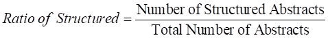
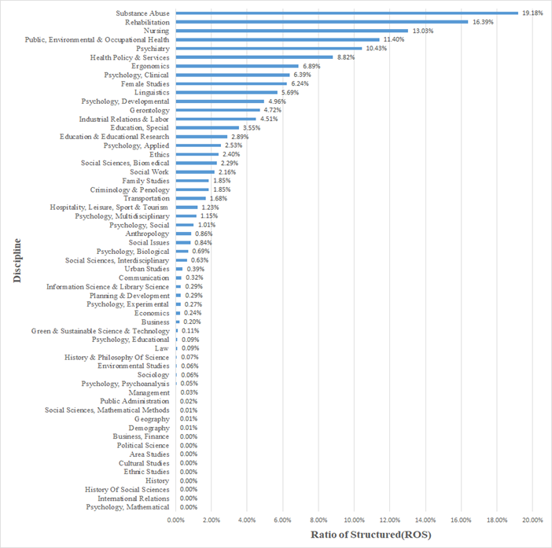
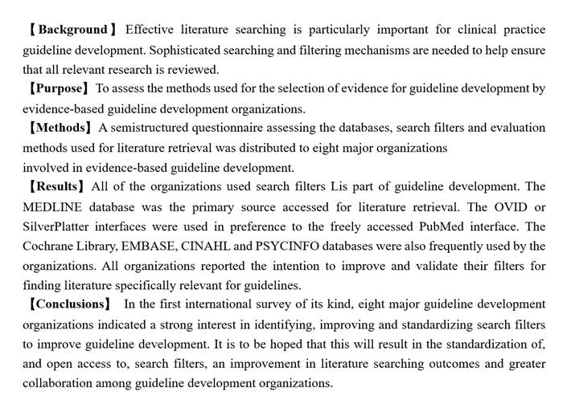

# SSCI_Abstract_Structures_Identification
The data for the paper 'A Model for the Identification of the Functional Structures of Unstructured Abstracts in Social Sciences'.

**Introduction**

Reorganising unstructured academic abstracts according to a certain logical structure can help scholars not only  extract valid information quickly, but also facilitate the faceted search of academic literature.

This study investigated the structuring of abstracts in academic articles in the field of social sciences, using large-scale statistical analyses. The functional structures of sentences in the abstract  were identified  by using several models. The experimental results show that BERT exhibited the best performance, the overall F1 score of which was 86.23%.

A web application for the identification of the functional structures of abstracts and their faceted search in social sciences was constructed.

**Data**

*1 Social science structured analysis*

The academic abstracts in this research were obtained from Web of Science (WOS).  This research acquired a total of 3,510,332 academic abstracts included in SSCI from 2008 to 2020.  As shown in Eq. (1), by computing the ratio of the structured abstracts, it can be seen that 3.462% of the abstracts are structured. 

​									          (1) 

**Fig. 1 Distribution of structured abstracts in disciplines of the social sciences**

 

*2 Analysis of the functional structures of sentences in abstracts*

Sentences in abstracts in the social sciences include the following five functional elements, i.e., background, purpose, methods, results, and conclusions. An example of an annotated social science abstract from the dataset is shown in Fig. 2.

**Fig. 2 Example of an annotated abstract in the social science dataset**

Table Ⅰ shows the category distribution of the functional structures of abstracts, where the occurrence percentages of conclusions and methods are the highest, accounting for 24.38% and 24.37% respectively, while the occurrence percentages of purpose and background are lower, 11.67% and 17.82%, respectively.

**Table Ⅰ Category distribution of sentences’ functional structure**

| Functional categories | Specific tags contained in functional structure              | Numbers | Percentages |
| --------------------- | ------------------------------------------------------------ | ------- | ----------- |
| Background            | Background, Context, Introduction, etc.                      | 94,477  | 17.82%      |
| Purpose               | Purpose, Originality/value, Objectives, etc.                 | 61,896  | 11.67%      |
| Methods               | Design/methodology/approach, measurement (s), analysis, etc. | 129,248 | 24.37%      |
| Results               | Result (s), Outcome measure, Principal Findings, etc.        | 115,404 | 21.76%      |
| Conclusions           | Conclusion (s), Discussion, Limitations, implications, etc.  | 129,289 | 24.38%      |

------

**DATASET & Trained Models & Code**

The dataset and parts of trained models are stored in [google drive](https://drive.google.com/drive/folders/1XKtxUvnAhrLLWNZO0WKCqifMuTFkOIxe?usp=sharing).

The code of models for experiment are provided in this project.

1. SVM: svm.py
2. BERT: bert_classify.py
3. LSTM & GRU: lstm_rnn_gru_attention_crf

